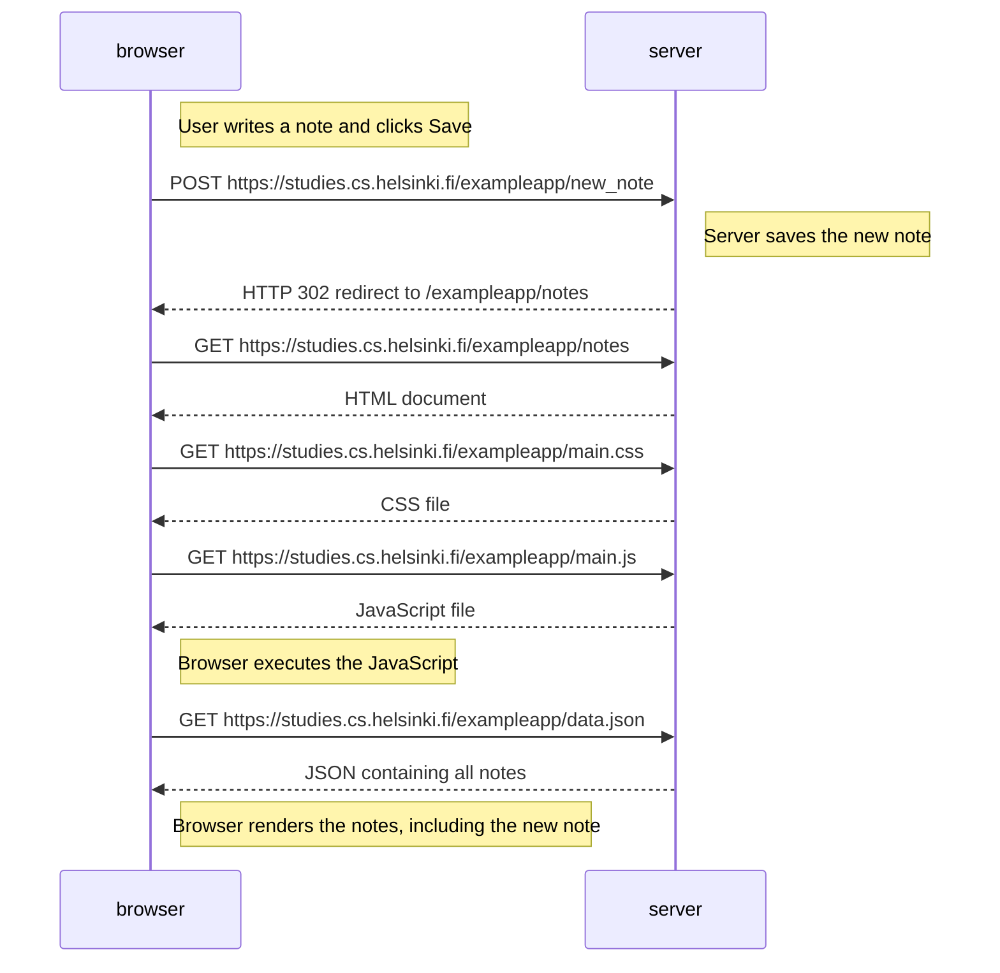

# Exercise 0.4: New note

```mermaid
sequenceDiagram
    participant browser
    participant server

    Note right of browser: User writes a note and clicks Save

    browser->>server: POST https://studies.cs.helsinki.fi/exampleapp/new_note
    Note right of server: Server saves the new note

    server-->>browser: HTTP 302 redirect to /exampleapp/notes

    browser->>server: GET https://studies.cs.helsinki.fi/exampleapp/notes
    server-->>browser: HTML document

    browser->>server: GET https://studies.cs.helsinki.fi/exampleapp/main.css
    server-->>browser: CSS file

    browser->>server: GET https://studies.cs.helsinki.fi/exampleapp/main.js
    server-->>browser: JavaScript file

    Note right of browser: Browser executes the JavaScript

    browser->>server: GET https://studies.cs.helsinki.fi/exampleapp/data.json
    server-->>browser: JSON containing all notes

    Note right of browser: Browser renders the notes, including the new note
```
